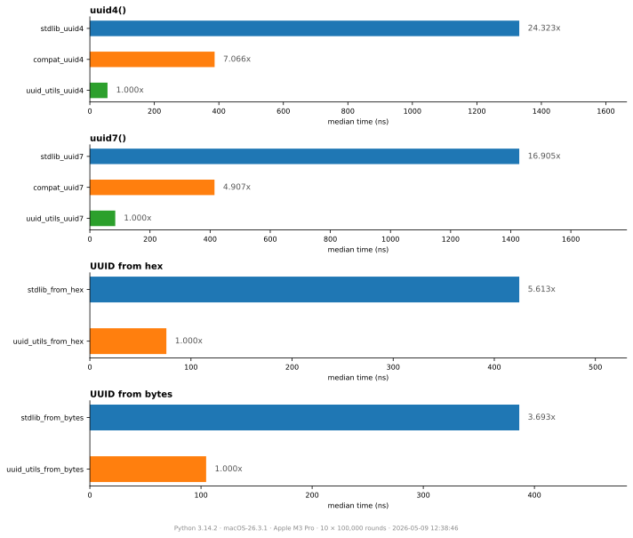

# Python UUID Utils

<div align="center">

[](https://pypi.org/project/uuid-utils/)

[](https://pypi.org/project/uuid-utils)
[](https://codspeed.io/aminalaee/uuid-utils?utm_source=badge)

</div>

---

Fast, drop-in replacement for Python's uuid module, powered by Rust.

Available UUID versions:

- `uuid1` - Version 1 UUIDs using a timestamp and monotonic counter.
- `uuid3` - Version 3 UUIDs based on the MD5 hash of some data.
- `uuid4` - Version 4 UUIDs with random data.
- `uuid5` - Version 5 UUIDs based on the SHA1 hash of some data.
- `uuid6` - Version 6 UUIDs using a timestamp and monotonic counter.
- `uuid7` - Version 7 UUIDs using a Unix timestamp ordered by time.
- `uuid8` - Version 8 UUIDs using user-defined data.

## Installation
Using `pip`:
```shell
pip install uuid-utils
```
or, using `conda`:

```shell
conda install -c conda-forge uuid-utils
```

## Example

```shell
>>> import uuid_utils as uuid

>>> # make a random UUID
>>> uuid.uuid4()
UUID('ffe95fcc-b818-4aca-a350-e0a35b9de6ec')

>>> # make a random UUID using a Unix timestamp which is time-ordered.
>>> uuid.uuid7()
UUID('018afa4a-0d21-7e6c-b857-012bc678552b')

>>> # make a UUID using a SHA-1 hash of a namespace UUID and a name
>>> uuid.uuid5(uuid.NAMESPACE_DNS, 'python.org')
UUID('886313e1-3b8a-5372-9b90-0c9aee199e5d')

>>> # make a UUID using an MD5 hash of a namespace UUID and a name
>>> uuid.uuid3(uuid.NAMESPACE_DNS, 'python.org')
UUID('6fa459ea-ee8a-3ca4-894e-db77e160355e')
```

## Compatibility with Python UUID

Some frameworks (e.g. Django) require `UUID` instances from the standard-library `uuid` module,
not a custom subclass. Use `uuid_utils.compat` for a drop-in replacement that returns stdlib
`uuid.UUID` instances while still outperforming the standard library.

```py
>>> import uuid_utils.compat as uuid

>>> uuid.uuid4()
UUID('ffe95fcc-b818-4aca-a350-e0a35b9de6ec')
```

## Benchmarks



```
╭──────────────────────────────────── benchdiff ─────────────────────────────────────╮
│                                                                                    │
│   Benchmark                     Min           Median          Max           ×      │
│  ────────────────────────────────────────────────────────────────────────────────  │
│   uuid4()                                                                          │
│     stdlib_uuid4             1249.762ns     1294.023ns     1325.939ns    22.589x   │
│     compat_uuid4             409.614ns      417.891ns      437.917ns     7.295x    │
│     uuid_utils_uuid4          55.411ns       57.285ns       58.973ns     1.000x    │
│   uuid7()                                                                          │
│     stdlib_uuid7             1396.391ns     1451.147ns     1564.087ns    17.400x   │
│     compat_uuid7             427.337ns      432.519ns      436.724ns     5.186x    │
│     uuid_utils_uuid7          82.539ns       83.397ns      102.663ns     1.000x    │
│   UUID from hex                                                                    │
│     stdlib_from_hex          423.353ns      431.943ns      621.810ns     5.769x    │
│     uuid_utils_from_hex       74.149ns       74.868ns       75.613ns     1.000x    │
│   UUID from bytes                                                                  │
│     stdlib_from_bytes        370.027ns      373.883ns      383.646ns     3.772x    │
│     uuid_utils_from_bytes     97.189ns       99.132ns      102.382ns     1.000x    │
│                                                                                    │
│ ────────────────────────────────────────────────────────────────────────────────── │
│   Python      3.14.2                                                               │
│   Platform    macOS-26.3.1                                                         │
│   CPU         Apple M3 Pro                                                         │
│   Rounds      10 × 100,000 calls                                                   │
│   Date        2026-05-09 12:38:51                                                  │
╰────────────────────────────────────────────────────────────────────────────────────╯
```

## How to develop locally

```shell
make build
make test
```

Or:

```shell
maturin develop --release
```
